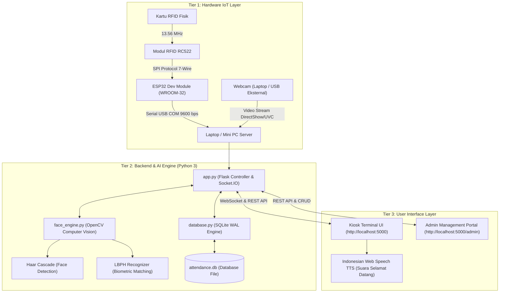
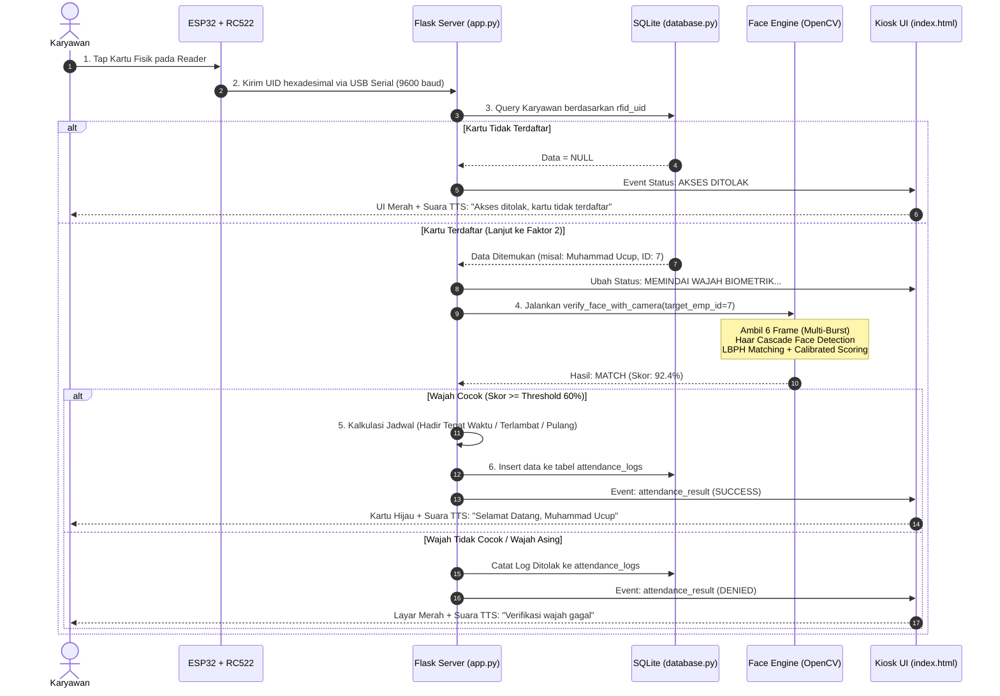

# 📋 DOKUMENTASI SISTEM ABSENSI 2FA LENGKAP
## Smart Attendance System: RFID (ESP32 + RC522) & Biometric Face Recognition (OpenCV AI)

---

## DAFTAR ISI
1. [Ringkasan Eksekutif & Konsep 2FA](#1-ringkasan-eksekutif--konsep-2fa)
2. [Arsitektur Sistem (Hardware, Backend, & Frontend)](#2-arsitektur-sistem)
3. [Perangkat Keras (Hardware & Pinout)](#3-perangkat-keras-hardware--pinout)
4. [Alur Kerja Operasional (End-to-End Workflow)](#4-alur-kerja-operasional-end-to-end-workflow)
5. [Mesin Biometrik & Pengolahan Citra (Face Engine)](#5-mesin-biometrik--pengolahan-citra-face-engine)
6. [Struktur Basis Data (Database SQLite)](#6-struktur-basis-data-database-sqlite)
7. [Antarmuka Web (Kiosk & Portal Admin)](#7-antarmuka-web-kiosk--portal-admin)
8. [Panduan Instalasi & Menjalankan Sistem](#8-panduan-instalasi--menjalankan-sistem)
9. [Troubleshooting & Solusi Kendala Umum](#9-troubleshooting--solusi-kendala-umum)

---

## 1. RINGKASAN EKSEKUTIF & KONSEP 2FA

Sistem **Smart Attendance 2FA** adalah solusi cerdas presensi berbasis *Internet of Things* (IoT) dan *Artificial Intelligence* (AI). Sistem ini dirancang untuk memecahkan kelemahan sistem absensi konvensional, terutama praktik **titip absen (*buddy punching*)** dan manipulasi waktu.

### Mengapa Menggunakan 2-Factor Authentication (2FA)?
Dalam keamanan sistem, autentikasi yang kuat menggabungkan dua kategori faktor yang berbeda:

| Faktor Autentikasi | Definisi | Implementasi pada Sistem | Keunggulan Keamanan |
| :--- | :--- | :--- | :--- |
| **Faktor 1: What You Have** | Benda fisik yang dimiliki oleh pengguna. | **Kartu / Gantungan Kunci RFID (Frekuensi 13.56 MHz)** | Membaca kode unik fisik (*UID Hexadesimal*) secara instan (< 100 ms). |
| **Faktor 2: Who You Are** | Karakteristik biometrik tubuh unik pengguna. | **Pengenalan Wajah AI (OpenCV Haar Cascade + LBPH)** | Memastikan orang yang menempelkan kartu adalah benar-benar pemilik sah kartu tersebut. |

> **Mekanisme Anti-Titip Absen:** Jika seorang karyawan mencoba men-tap kartu milik rekannya, sistem akan mendeteksi kartu tersebut, tetapi saat kamera mencocokkan wajah, kecocokan biometrik akan gagal dan status **AKSES DITOLAK** (*Access Denied*) otomatis tercatat di log audit.

---

## 2. ARSITEKTUR SISTEM

Sistem ini dibangun dengan arsitektur 3 lapis (*Three-Tier Architecture*):



---

## 3. PERANGKAT KERAS (HARDWARE & PINOUT)

### A. Daftar Komponen
1. **Mikrokontroler:** ESP32 DevKit V1 (NodeMCU-32S, 30-Pin WROOM-32).
2. **Reader RFID:** MFRC522 (HW-126) + Kartu RFID Mifare Classic 1K / Keyfob.
3. **Kamera:** Webcam bawaan laptop (*Index 0*) atau Webcam USB eksternal (*Index 1*).
4. **Kabel:** 7 kabel jumper Female-to-Female (atau Male-to-Female jika memakai breadboard).

### B. Skema Jalur Kabel SPI (Hanya 7 Kabel)
Firmware: `esp32_rfid_only/esp32_rfid_only.ino`

Semua 7 kabel dicolokkan ke **sisi pin bagian bawah ESP32** (sisi yang memuat pin `3V3`, `GND`, `D4`, `D5`, `D18`, `D19`, dan `D23`):

| No | Pin Modul RFID RC522 | Pin ESP32 (DevKit 30-Pin) | Keterangan Fungsi |
| :---: | :--- | :--- | :--- |
| **1** | **3.3V (VCC)** *(Dekat LED merah)* | **3V3** | Sumber tegangan 3.3V *(DILARANG 5V/VIN)* |
| **2** | **RST** | **D4** (GPIO 4) | Reset modul RFID |
| **3** | **GND** | **GND** | Ground catu daya |
| **4** | **IRQ** | *(Biarkan Kosong)* | Pin interrupt tidak digunakan |
| **5** | **MISO** | **D19** (GPIO 19) | Master In Slave Out (Data SPI In) |
| **6** | **MOSI** | **D23** (GPIO 23) | Master Out Slave In (Data SPI Out) |
| **7** | **SCK** | **D18** (GPIO 18) | Serial Clock SPI |
| **8** | **SDA (SS)** *(Dekat kristal OSC)* | **D5** (GPIO 5) | Slave Select (Chip Select) |

*Indikator Fisik:* LED onboard ESP32 pada **GPIO 2** otomatis berkedip setiap kali kartu RFID berhasil terbaca.

---

## 4. ALUR KERJA OPERASIONAL (END-TO-END WORKFLOW)



---

## 5. MESIN BIOMETRIK & PENGOLAHAN CITRA (FACE ENGINE)

File modul: `face_engine.py`

### A. Algoritma yang Digunakan
1. **Deteksi Wajah (*Haar Cascade Classifier*):**
   * Menggunakan model pre-trained OpenCV `haarcascade_frontalface_default.xml`.
   * Mendeteksi posisi bounding box wajah `(x, y, w, h)` secara real-time pada resolusi 640×480.
   * Diterapkan **Margin Padding 12%** di sekeliling kotak deteksi agar dahi, telinga samping, dan garis dagu tidak terpotong saat diekstraksi.

2. **Pengenalan Wajah (*LBPH Face Recognizer*):**
   * *Local Binary Patterns Histograms* membagi citra wajah menjadi kisi-kisi lokal (*grid cells* 8×8), menghitung pola biner piksel tetangga, dan menghasilkan histogram fitur unik.
   * **Kelebihan:** Sangat cepat, hemat CPU, tidak memerlukan GPU mahal, dan tahan terhadap variasi pencahayaan ruangan.

### B. Pra-Pemrosesan Citra (*Image Preprocessing Pipeline*)
Setiap sampel wajah sebelum dilatih atau diuji melalui tahapan:
1. Konversi ke Skala Abu-Abu (*Grayscale*).
2. Penambahan Margin Wajah (12% keliling).
3. Normalisasi resolusi seragam menjadi **200 × 200 piksel**.
4. *Histogram Equalization* (`cv2.equalizeHist`) untuk meratakan kontras pencahayaan.
5. *Gaussian Blur* filter (kernel 3×3) untuk mereduksi *sensor noise* webcam.

### C. Teknik Peningkatan Akurasi (*Multi-Burst Sampling & Calibrated Scoring*)
* **Multi-Frame Burst (6 Frame):** Saat verifikasi, sistem tidak hanya mengambil 1 foto tunggal, melainkan menangkap **6 frame berurutan dalam rentang 0.6 detik** dan mengambil frame dengan kecocokan tertinggi. Hal ini membuat sistem kebal terhadap kedipan mata atau sedikit gerakan kepala.
* **Rumus Kalibrasi Jarak (*Calibrated Chi-Square Distance*):**
  $$\text{Jarak } \le 70 \implies \text{Skor: } 88\% - 99\% \quad (\text{Identik / Sangat Cocok})$$
  $$\text{Jarak } 70 - 95 \implies \text{Skor: } 72\% - 88\% \quad (\text{Cocok})$$
  $$\text{Jarak } 95 - 120 \implies \text{Skor: } 40\% - 72\% \quad (\text{Kurang Cocok})$$
  $$\text{Jarak } > 120 \implies \text{Skor: } < 40\% \quad (\text{Wajah Berbeda / Asing})$$

---

## 6. STRUKTUR BASIS DATA (DATABASE SQLITE)

File modul: `database.py`  
Lokasi database: `data/attendance.db`

Database dikonfigurasi dengan mode **WAL (*Write-Ahead Logging*)** dan penguncian *thread-safe* (`threading.Lock()`) agar dapat diakses bersamaan oleh *background serial worker*, *camera loop*, dan *web request* tanpa terjadi `database is locked`.

### Skema Tabel:

#### 1. Tabel `employees` (Data Karyawan)
| Kolom | Tipe Data | Keterangan |
| :--- | :--- | :--- |
| `id` | INTEGER PRIMARY KEY | ID unik otomatis bertambah (*Auto Increment*) |
| `nik` | TEXT UNIQUE NOT NULL | Nomor Induk Karyawan unik |
| `name` | TEXT NOT NULL | Nama lengkap karyawan |
| `department` | TEXT NOT NULL | Nama departemen/divisi |
| `role` | TEXT NOT NULL | Jabatan karyawan |
| `rfid_uid` | TEXT UNIQUE | Kode fisik kartu RFID (contoh: `6974F903`) |
| `photo_url` | TEXT | URL foto profil (opsional) |
| `face_enrolled` | INTEGER DEFAULT 0 | Jumlah sampel wajah yang terdaftar |
| `is_active` | INTEGER DEFAULT 1 | Status aktif karyawan (1 = Aktif, 0 = Nonaktif) |
| `created_at` | TEXT | Waktu pendaftaran |

#### 2. Tabel `attendance_logs` (Riwayat Kehadiran)
| Kolom | Tipe Data | Keterangan |
| :--- | :--- | :--- |
| `id` | INTEGER PRIMARY KEY | ID log absensi |
| `employee_id` | INTEGER | Relasi ke `employees.id` (ON DELETE SET NULL) |
| `rfid_uid` | TEXT NOT NULL | UID kartu saat tap |
| `employee_name` | TEXT NOT NULL | Nama karyawan saat absensi |
| `department` | TEXT | Departemen |
| `role` | TEXT | Jabatan |
| `timestamp` | TEXT NOT NULL | Jam absensi (`HH:MM:SS`) |
| `date` | TEXT NOT NULL | Tanggal absensi (`YYYY-MM-DD`) |
| `scan_type` | TEXT | Jenis: `check_in` atau `check_out` |
| `status` | TEXT NOT NULL | Status: `hadir`, `terlambat`, `pulang`, `ditolak` |
| `confidence` | TEXT | Persentase kecocokan AI (contoh: `92.4%`) |
| `verification_mode` | TEXT | Mode: `rfid_face` |
| `notes` | TEXT | Catatan status (misal: "Terlambat 12 menit") |

#### 3. Tabel `settings` (Konfigurasi Sistem)
Menyimpan konfigurasi dinamis yang dapat diubah melalui portal admin:
* `work_start_time` (Default: `08:00`)
* `late_tolerance_minutes` (Default: `15`)
* `work_end_time` (Default: `17:00`)
* `simulation_mode` (Default: `false`)
* `serial_port` (Default: `COM10`)
* `serial_baudrate` (Default: `9600`)
* `face_threshold` (Default: `60%`)
* `camera_index` (Default: `0` untuk internal, `1` untuk USB eksternal)
* `kiosk_mode` (Default: `auto`)

---

## 7. ANTARMUKA WEB (KIOSK & PORTAL ADMIN)

### A. Terminal Kiosk (`http://localhost:5000/`)
* **Live Webcam HUD:** Umpan video real-time dengan animasi pemindai biometrik (garis laser pemindai cyan/emerald).
* **Mode Otomatis:** Otomatis mencatat **Absen Masuk** jika belum hadir hari ini, dan **Absen Pulang** jika sudah pernah tap masuk.
* **Indonesian Voice Feedback (TTS):** Browser membacakan salam menggunakan suara bahasa Indonesia:
  * *"Selamat datang, Muhammad Ucup. Absen Masuk berhasil dicatat."*
  * *"Selamat sore, Muhammad Ucup. Absen Pulang berhasil dicatat."*
  * *"Verifikasi wajah gagal. Wajah tidak cocok dengan pemilik kartu."*
* **Bypass Simulasi RFID:** Tombol virtual di bawah layar untuk simulasi tap kartu jika alat fisik sedang dicabut.

### B. Portal Admin (`http://localhost:5000/admin`)
* **Dashboard Metrik:** Kartu ringkasan kehadiran hari ini (Total Kehadiran, Hadir Tepat Waktu, Terlambat, Ditolak, Total Karyawan).
* **Kelola Karyawan (CRUD):** Tambah karyawan, edit data/kartu, serta hapus karyawan (otomatis membebaskan kartu RFID dan menghapus data wajah).
* **Pendaftaran Wajah Online (*Face Enrollment*):**
  * Klik tombol **Biometrik** di tabel karyawan.
  * Preview kamera live menampilkan kotak panduan wajah.
  * Ambil 3–5 sampel foto langsung lewat tombol **Ambil Foto via Kamera** (atau upload foto manual).
  * Model AI otomatis dilatih ulang seketika (*auto re-train*).
* **Log Absensi & Export CSV:** Filter riwayat absensi berdasarkan rentang tanggal, departemen, dan status kehadiran, serta tombol unduh file Excel/CSV.
* **Pengaturan Hardware:** Pengaturan port serial COM, pilihan kamera webcam (Internal 0 / USB 1), dan ambang batas sensitivitas AI.

---

## 8. PANDUAN INSTALASI & MENJALANKAN SISTEM

### Prasyarat Sistem
* Sistem Operasi: Windows 10 / 11 (atau Linux / macOS).
* Python 3.9 – 3.12.
* Arduino IDE (untuk upload firmware ESP32).
* Port USB tersedia untuk ESP32 dan Webcam USB.

### Langkah 1: Persiapan Environment Python
```powershell
# Masuk ke folder proyek
cd "c:\Users\ACER NITRO\.gemini\antigravity\scratch\rfid_face_attendance"

# Aktifkan virtual environment
.\venv\Scripts\activate

# Instal dependensi (jika baru setup)
pip install -r requirements.txt
```

### Langkah 2: Upload Firmware ke ESP32
1. Buka file `esp32_rfid_only/esp32_rfid_only.ino` di Arduino IDE.
2. Pilih Board: **ESP32 Dev Module**.
3. Pilih Port: Sesuai port terdeteksi (contoh: **COM10**).
4. Klik tombol **Upload**.
5. Buka Serial Monitor (9600 baud) dan tekan tombol **EN** di ESP32 hingga muncul pesan:
   ```text
   [OK] Modul RFID RC522 Siap! Firmware Versi: 0x92
   >> Tempelkan kartu / gantungan RFID ke reader...
   ```
6. **PENTING:** Tutup jendela Serial Monitor Arduino IDE sebelum menjalankan server Python agar port COM10 tidak bentrok (*busy*).

### Langkah 3: Menjalankan Server Web Python
Jalankan perintah berikut di terminal:
```powershell
.\venv\Scripts\python.exe app.py
```
Output terminal akan menampilkan:
```text
====================================================================
 SMART ATTENDANCE SYSTEM: RFID + BIOMETRIC FACE RECOGNITION 2FA
 Kiosk Terminal: http://127.0.0.1:5000/
 Admin Portal:   http://127.0.0.1:5000/admin
====================================================================
```

### Langkah 4: Buka di Browser
* Buka **[http://localhost:5000](http://localhost:5000)** untuk layar Terminal Kiosk Karyawan.
* Buka **[http://localhost:5000/admin](http://localhost:5000/admin)** untuk Portal Manajemen HRD.

---

## 9. TROUBLESHOOTING & SOLUSI KENDALA UMUM

| Gejala / Pesan Error | Penyebab | Solusi |
| :--- | :--- | :--- |
| `[WARN] Modul RFID RC522 BELUM TERDETEKSI!` | Sambungan kabel SPI longgar, salah colok pin, atau timah solder saling menyatu (*solder bridge*). | Pastikan semua 8 pin RFID disolder rapi per pin (tidak boleh menyambung antar pin). Pastikan semua 7 kabel dicolokkan ke baris bawah ESP32 (`3V3`, `GND`, `D4`, `D5`, `D18`, `D19`, `D23`). |
| `Gagal: UID Kartu sudah dipakai oleh karyawan lain` | Kartu RFID tersebut sudah didaftarkan pada karyawan sebelumnya (aturan UNIQUE di database). | Hapus karyawan lama yang memegang kartu tersebut di menu Admin (kartu akan otomatis bebas), atau gunakan kartu RFID lain. |
| `Akses Ditolak (Skor AI rendah ~36%)` | Rumus persentase terlalu ketat atau pencahayaan kurang. | Sistem sudah diperbarui dengan rumus kalibrasi baru + burst 6 frame. Pastikan wajah menghadap lurus ke kamera dan ruangan memiliki pencahayaan cukup. Ambang batas diatur di **60%**. |
| Kamera tidak menyala / Ingin webcam eksternal | Index kamera belum diarahkan ke port USB yang tepat. | Buka Admin -> **Pengaturan Sistem** -> ganti **Pilihan Kamera** menjadi **Kamera 1 (Webcam USB Eksternal)** -> klik **Simpan Konfigurasi Sistem**. |
| `Port error: [Errno 13] could not open port COM10` | Port COM10 masih terkunci oleh aplikasi lain. | Tutup jendela **Serial Monitor** di Arduino IDE atau aplikasi terminal serial lainnya. |

---

*Dokumen ini dibuat secara otomatis dan komprehensif sebagai panduan arsitektur teknis serta manual operasional sistem Smart Attendance 2FA.*
