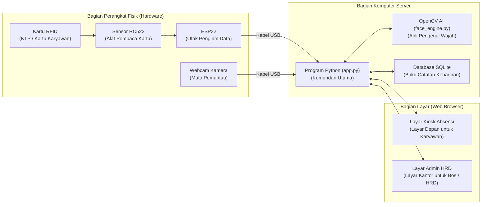
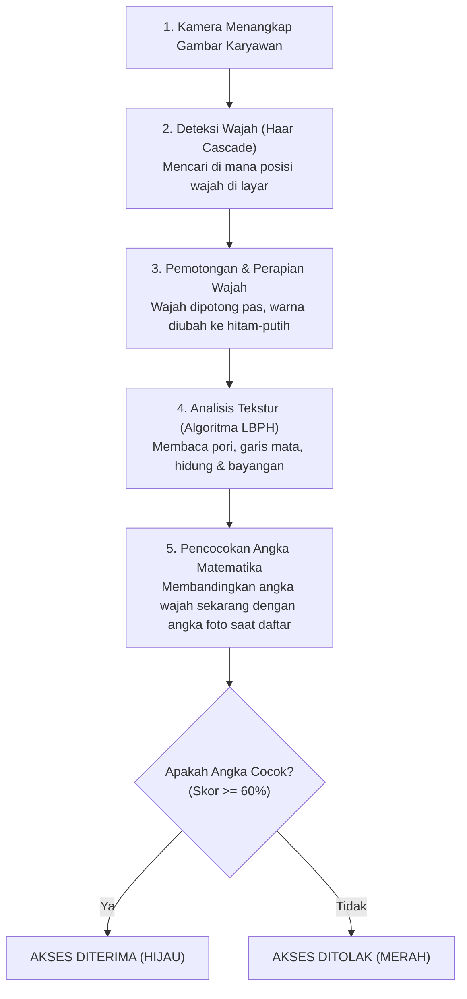

# 📘 BUKU PANDUAN & DOKUMENTASI LENGKAP SISTEM ABSENSI CERDAS 2FA
## Panduan Penjelasan Sistem Absensi RFID & Pengenalan Wajah AI (Untuk Orang Awam hingga Profesional)

---

## 📑 DAFTAR ISI
1. [Pengantar Sederhana: Apa Itu Sistem Ini?](#1-pengantar-sederhana-apa-itu-sistem-ini)
2. [Masalah Nyata: Mengapa Sistem Ini Diciptakan?](#2-masalah-nyata-mengapa-sistem-ini-diciptakan)
3. [Konsep "2FA": Keamanan Lapis Ganda Menggunakan Analogi Sederhana](#3-konsep-2fa-keamanan-lapis-ganda-menggunakan-analogi-sederhana)
4. [Mengenal Alat dan Komponen Sistem (Analogi Peran)](#4-mengenal-alat-dan-komponen-sistem-analogi-peran)
5. [Cerita Simulasi: Bagaimana Sistem Bekerja dari Detik ke Detik?](#5-cerita-simulasi-bagaimana-sistem-bekerja-dari-detik-ke-detik)
6. [Bagaimana Cara AI Mengenali Wajah Kita? (Rahasia Dapur AI)](#6-bagaimana-cara-ai-mengenali-wajah-kita-rahasia-dapur-ai)
7. [Fasilitas untuk Bagian HRD / Manajemen (Portal Admin)](#7-fasilitas-untuk-bagian-hrd--manajemen-portal-admin)
8. [Panduan Rangkaian Kabel Fisik (Sederhana & Jelas)](#8-panduan-rangkaian-kabel-fisik-sederhana--jelas)
9. [Panduan Menjalankan Sistem Langkah demi Langkah](#9-panduan-menjalankan-sistem-langkah-demi-langkah)
10. [Tanya Jawab yang Sering Ditanyakan (FAQ)](#10-tanya-jawab-yang-sering-ditanyakan-faq)

---

## 1. PENGANTAR SEDERHANA: APA ITU SISTEM INI?

Bayangkan di depan pintu masuk kantor atau sekolah ada **seorang satpam digital yang super teliti, tidak pernah mengantuk, dan tidak bisa disuap**. 

Ketika ada seseorang yang ingin mencatat kehadiran:
1. Orang tersebut menempelkan kartu identitasnya (*Tap Kartu RFID*).
2. Satpam digital melihat nama di kartu tersebut, lalu menatap wajah orang tersebut lewat kamera (*Scan Wajah Biometrik*).
3. Jika orang yang menempelkan kartu **benar-benar pemilik asli kartu**, satpam akan tersenyum, menyapa dengan suara ramah: *"Selamat datang, Muhammad Ucup!"*, dan otomatis mencatat jam hadirnya ke buku komputer.
4. Jika ternyata **kartu itu milik orang lain yang dititipkan ke temannya**, satpam digital langsung tahu: *"Wajah Anda tidak cocok dengan pemilik kartu!"* dan akses ditolak!

Inilah yang disebut **Smart Attendance System 2FA (Two-Factor Authentication)**.

---

## 2. MASALAH NYATA: MENGAPA SISTEM INI DICIPTAKAN?

Sebelum ada sistem ini, banyak kantor dan sekolah menggunakan cara absensi lama yang memiliki banyak kelemahan:

| Metode Lama | Kelemahan di Lapangan | Solusi Sistem Absensi 2FA Ini |
| :--- | :--- | :--- |
| **Kertas Tanda Tangan** | Sangat mudah dipalsukan, teman bisa menandatangani nama temannya (*titip absen*), kertas bisa basah/hilang. | **Digital 100%:** Data langsung tersimpan di komputer detik itu juga. |
| **Kartu Biasa (Hanya RFID)** | Karyawan yang malas bisa memberikan kartunya ke rekan kerja untuk di-tap kan (*Buddy Punching*). | **Wajib Verifikasi Wajah:** Menempelkan kartu saja tidak cukup; orangnya harus berdiri di depan kamera. |
| **Hanya Sidik Jari (Fingerprint)** | Alat sering kotor oleh minyak/debu, jari yang basah sering gagal terbaca, antrean menjadi lambat, dan tidak higienis karena disentuh banyak orang. | **Tanpa Sentuh (*Touchless*):** Cukup dekatkan kartu tanpa menempel penuh, dan wajah dipindai dari jarak jauh tanpa menyentuh layar. |

---

## 3. KONSEP "2FA": KEAMANAN LAPIS GANDA MENGGUNAKAN ANALOGI SEDERHANA

Istilah **2FA (Two-Factor Authentication)** terdengar rumit, tetapi sebenarnya kita sudah menggunakannya setiap hari saat mengambil uang di mesin ATM:

1. **Faktor 1 (Benda yang Anda Pegang / *What You Have*):**
   * Di ATM: Anda harus memasukkan **Kartu ATM fisik**.
   * Di Sistem Ini: Anda harus menempelkan **Kartu RFID Fisik**.
2. **Faktor 2 (Bukti Diri Anda Sendiri / *Who You Are*):**
   * Di ATM: Anda memasukkan kode PIN rahasia yang hanya Anda yang tahu.
   * Di Sistem Ini: **Wajah Anda Sendiri**. Karena wajah setiap manusia unik, sistem AI mencocokkan wajah fisik orang di depan kamera dengan foto pemilik kartu di database.

> **Kesimpulan:** Jika ada orang menemukan kartu Anda di jalan, dia **TIDAK BISA** menggunakannya untuk absen karena wajahnya berbeda dengan Anda!

---

## 4. MENGENAL ALAT DAN KOMPONEN SISTEM (ANALOGI PERAN)

Agar mudah dipahami, mari kita bagi sistem ini menjadi anggota tim yang bekerja bersama:



### 1. Kartu RFID & Gantungan Biru (*Tag RFID*)
* **Peran:** Kartu identitas elektronik.
* Di dalam kartu tipis ini terdapat kawat antena kecil dan chip tanpa baterai. Saat didekatkan ke sensor, kartu memancarkan nomor seri unik (disebut **UID**, contohnya: `6974F903`). Tidak ada dua kartu di dunia yang memiliki UID yang sama.

### 2. Modul RFID RC522 (Papan Biru Kecil)
* **Peran:** "Telinga" pendengar kartu.
* Memancarkan gelombang frekuensi radio 13.56 MHz untuk membaca nomor UID kartu saat jaraknya sekitar 1–3 cm.

### 3. Mikrokontroler ESP32
* **Peran:** "Kurir pengantar pesan".
* Komputer mini berukuran kecil seukuran jempol yang bertugas menerima nomor UID dari modul RFID, lalu mengirimkannya lewat kabel USB ke laptop/komputer server dalam hitungan mikrodetik.

### 4. Kamera Webcam (Laptop atau USB Eksternal)
* **Peran:** "Mata" pengawas.
* Mengambil video wajah karyawan yang sedang berdiri di depan layar.

### 5. Komputer Server (Program Python `app.py`)
* **Peran:** "Komandan Utama / Manajer".
* Mengatur segalanya: menerima nomor kartu dari ESP32, menyuruh AI memeriksa kamera, mencatat waktu jam masuk/pulang, dan mengirim data ke layar.

### 6. Mesin Pengenal Wajah AI (OpenCV di `face_engine.py`)
* **Peran:** "Detektif Biometrik".
* Mengukur bentuk dan kontur wajah dari kamera, lalu mencocokkannya dengan arsip foto wajah karyawan yang sudah disimpan.

### 7. Database SQLite (`attendance.db`)
* **Peran:** "Buku Kas / Buku Agenda Abadi".
* Menyimpan daftar nama karyawan, NIK, kartu RFID mereka, jam masuk, status keterlambatan, dan riwayat absensi harian secara rapi.

---

## 5. CERITA SIMULASI: BAGAIMANA SISTEM BEKERJA DARI DETIK KE DETIK?

Mari kita lihat 3 skenario yang terjadi di dunia nyata:

### Skenario A: Karyawan Absen dengan Benar (Sukses)
1. **Pukul 07.50 WIB**, seorang karyawan bernama **Muhammad Ucup** tiba di kantor.
2. Di meja resepsionis, layar tablet menyala dalam kondisi **STANDBY (Menunggu Kartu)**.
3. Ucup mendekatkan kartu gantungan birunya ke sensor RFID.
4. **Detik 0.1:** Sensor membaca UID `6974F903`. ESP32 mengirimkannya ke komputer.
5. **Detik 0.2:** Komputer memeriksa database: *"Oh, kartu ini milik Muhammad Ucup dari divisi Polisi/Sappol!"*
6. **Detik 0.3:** Layar berubah warna biru dengan tulisan: **"MEMINDAI WAJAH BIOMETRIK... Harap menatap kamera"**. Kamera menampilkan kotak hijau pemindai di wajah Ucup.
7. **Detik 0.8:** Kamera mengambil 6 foto cepat secara berurutan. AI membandingkannya dengan foto Ucup saat mendaftar. Hasil: **Kecocokan 92.4% (Sangat Cocok!)**.
8. **Detik 1.2:** Jam saat itu (07.50) dibandingkan dengan batas jam kantor (08.00). Karena datang sebelum jam 08.00, statusnya adalah **Hadir Tepat Waktu**.
9. **Detik 1.5:** Data tersimpan ke database. Layar berubah hijau cerah dengan lambang centang besar, dan pengeras suara berbicara dalam bahasa Indonesia:
   > 🔊 *"Selamat datang, Muhammad Ucup. Absen Masuk berhasil dicatat."*
10. **Detik 3.5:** Layar otomatis kembali tenang ke kondisi Standby, siap melayani karyawan berikutnya.

---

### Skenario B: Ada yang Coba Menitipkan Kartu (Akses Ditolak)
1. Karyawan bernama **Budi** tidak masuk kerja karena bangun kesiangan.
2. Budi menitipkan kartunya kepada temannya, **Doni**.
3. Doni mencoba menempelkan kartu milik Budi di sensor RFID.
4. Komputer membaca: *"Kartu milik Budi Santoso!"*, lalu kamera menyala untuk memindai wajah orang di depannya.
5. AI memeriksa wajah Doni yang berdiri di depan kamera dan membandingkannya dengan foto asli Budi.
6. Hasil AI: **Kecocokan hanya 25% (Wajah Berbeda!)**.
7. **Hasil:** Layar langsung menyala **MERAH** dengan tulisan besar:
   > ❌ **AKSES DITOLAK: Wajah Tidak Cocok dengan Pemilik Kartu!**
8. Komputer bersuara: *"Verifikasi wajah gagal!"* dan tidak ada catatan hadir yang masuk ke akun Budi. Praktik titip absen berhasil digagalkan!

---

### Skenario C: Kartu Orang Asing / Belum Terdaftar
1. Seseorang mencoba menempelkan kartu e-Toll atau kartu yang belum pernah didaftarkan oleh HRD.
2. Komputer mencari nomor UID kartu tersebut di database dan tidak menemukannya.
3. Layar langsung menolak seketika tanpa menyalakan pemindai wajah:
   > ❌ *"Akses Ditolak: Kartu RFID belum terdaftar di sistem!"*

---

## 6. BAGAIMANA CARA AI MENGENALI WAJAH KITA? (RAHASIA DAPUR AI)

Bagi orang awam, kemampuan komputer mengenali wajah terasa seperti sulap. Bagaimana sebenarnya cara komputer bekerja?



### Tahap 1: Menemukan Posisi Wajah (*Haar Cascade*)
Kamera melihat seluruh ruangan (ada tembok, lampu, pintu, baju). Algoritma pertama bertugas mencari pola: *"Mana yang memiliki dua mata, satu hidung, dan satu mulut?"*. Begitu pola tersebut ditemukan, algoritma membuat kotak hijau tepat di sekeliling wajah.

### Tahap 2: Menghilangkan Gangguan Warna (*Grayscale & Equalization*)
Wajah diubah menjadi hitam-putih, lalu bayangan gelap diterangkan dan bagian terlalu silau diturunkan (*Histogram Equalization*). Tujuannya agar saat karyawan datang di pagi hari (terang) atau sore hari (agak redup), AI tetap melihat wajah yang sama tanpa terkecoh warna lampu.

### Tahap 3: Membaca Ciri Khas Wajah (*LBPH - Local Binary Patterns Histograms*)
Komputer tidak melihat wajah seperti manusia melihat mata dan hidung. Komputer membagi wajah menjadi kotak-kotak kecil, lalu melihat hubungan terang-gelap antar piksel (tekstur lekukan dahi, jarak mata ke hidung, kontur pipi dan dagu). Pola ini diubah menjadi **rangkaian angka statistik (histogram unik)**.

### Tahap 4: Mengapa Dibuat Sistem "6 Frame Sekaligus"?
Jika kamera hanya menjepret 1 foto dalam 1 detik, bisa saja karyawan pas sedang berkedip, bersin, atau menoleh. 
Oleh karena itu, sistem kami diprogram mengambil **6 foto berturut-turut dalam waktu 0.6 detik**. Sistem akan mencari foto mana yang paling jelas dan paling cocok. Itulah sebabnya verifikasi di sistem ini sangat cepat dan akurat!

---

## 7. FASILITAS UNTUK BAGIAN HRD / MANAJEMEN (PORTAL ADMIN)

Untuk pimpinan kantor atau staf HRD, sistem menyediakan halaman khusus di browser: **`http://localhost:5000/admin`**.

```
┌────────────────────────────────────────────────────────────────────────┐
│                        PORTAL MANAJEMEN ADMIN                          │
├────────────────────────────────────────────────────────────────────────┤
│  [📊 Dashboard]   [👥 Kelola Karyawan]   [📑 Laporan]   [⚙️ Pengaturan] │
└────────────────────────────────────────────────────────────────────────┘
```

Apa saja yang bisa dilakukan oleh HRD di halaman ini?

### 1. Dashboard Kehadiran Real-Time (Tanpa Refresh Halaman)
* Menampilkan jumlah karyawan yang hadir hari ini secara otomatis.
* Menampilkan siapa yang datang tepat waktu dan siapa yang terlambat (beserta jumlah menit keterlambatannya).
* Menampilkan berapa kali percobaan absensi ditolak.

### 2. Menambah & Mengedit Karyawan Baru
* Cukup mengisi data sederhana: **Nama Karyawan**, **NIK**, **Departemen** (misal: Keuangan, IT, Gudang), **Jabatan**, dan **Nomor Kartu RFID**.
* Jika ingin menghapus karyawan yang sudah resign, cukup klik tombol hapus. Sistem otomatis **membebaskan kartu RFID-nya** sehingga kartu tersebut bisa diberikan ke pegawai baru berikutnya!

### 3. Pendaftaran Wajah Kilat (*Face Enrollment*)
* Tidak perlu menggunakan kamera terpisah. Cukup klik tombol **Biometrik** di samping nama karyawan.
* Kamera webcam akan menyala di layar.
* Minta karyawan berdiri di depan kamera, lalu klik tombol **"Ambil Foto via Kamera"** sebanyak 3–5 kali (dengan sedikit memiringkan kepala ke kiri, kanan, dan tersenyum).
* Sistem AI langsung memproses dan mempelajari wajah tersebut detik itu juga!

### 4. Ekspor Laporan Otomatis ke Microsoft Excel / CSV
* HRD tidak perlu lagi merekap kertas tanda tangan satu per satu di akhir bulan.
* Cukup pilih rentang tanggal (misal: 1 September s/d 30 September), klik **Export CSV**, dan file laporan kehadiran lengkap siap dibuka di Excel untuk penghitungan gaji/potongan keterlambatan!

### 5. Pengaturan Fleksibel dalam Sekali Klik
* **Jam Masuk Kantor:** Bisa diatur (contoh: jam 08:00 dengan batas toleransi 15 menit).
* **Ganti Kamera Webcam:** Jika laptop memiliki webcam bawaan buram dan Anda ingin memakai webcam USB eksternal yang jernih, cukup pilih **"Kamera 1 (Webcam USB Eksternal)"** di menu pengaturan, lalu klik Simpan. Kamera langsung berpindah tanpa perlu membongkar kodingan!

---

## 8. PANDUAN RANGKAIAN KABEL FISIK (SEDERHANA & JELAS)

Bagi Anda yang ingin merakit atau memeriksa alat fisik, berikut panduan yang sangat mudah:

### Prinsip Utama:
Modul pembaca kartu RFID (papan biru) disambungkan ke papan mikrokontroler ESP32 menggunakan **7 kabel jumper**. 

Perhatikan bahwa pada ESP32, **semua 7 kabel dicolokkan HANYA pada baris pin bagian bawah** (sisi yang memiliki tulisan pin `3V3`):

```
                      [ SISI ATAS ESP32: KOSONG ]
+--------------------------------------------------------------------+
| [Colokan USB]                   ESP32                     [Antena] |
+--------------------------------------------------------------------+
                      [ SISI BAWAH ESP32: COLOK DI SINI ]
    (3V3)  (GND)  (..)  (..)  (D4)  (..)  (..)  (D5)  (D18) (D19) ... (D23)
      │      │                 │                 │     │     │          │
      ▼      ▼                 ▼                 ▼     ▼     ▼          ▼
     3.3V   GND               RST               SDA   SCK   MISO       MOSI
    [────────────────── MODUL BIRU RFID RC522 ──────────────────────────]
```

### Tabel Sambungan 7 Kabel (Satu per Satu):
| No | Label Pin pada Modul RFID (Papan Biru) | Posisi Pin di Modul RFID | Dicolokkan ke Pin ESP32 | Fungsi Kabel dalam Bahasa Manusia |
| :---: | :--- | :--- | :--- | :--- |
| **1** | **3.3V** | Paling Kiri *(Dekat lampu merah)* | **Pin 3V3** | **Kabel Aliran Listrik (3.3 Volt)**. *Perhatian: Jangan dicolok ke 5V agar modul tidak rusak.* |
| **2** | **RST** | Nomor 2 dari kiri | **Pin D4** | **Kabel Tombol Reset Otomatis**. |
| **3** | **GND** | Nomor 3 dari kiri | **Pin GND** | **Kabel Masa / Arus Negatif (Ground)**. |
| **4** | **IRQ** | Nomor 4 dari kiri | *(KOSONGKAN)* | Tidak digunakan. |
| **5** | **MISO** | Nomor 5 dari kiri | **Pin D19** | **Kabel Jalur Data Masuk** (RFID mengirim pesan ke ESP32). |
| **6** | **MOSI** | Nomor 6 dari kiri | **Pin D23** | **Kabel Jalur Data Keluar** (ESP32 menyuruh RFID). |
| **7** | **SCK** | Nomor 7 dari kiri | **Pin D18** | **Kabel Detak Jam (Clock)** penentu irama pengiriman data. |
| **8** | **SDA** | Paling Kanan *(Dekat tabung perak)* | **Pin D5** | **Kabel Saklar Pemilih Sinyal**. |

---

## 9. PANDUAN MENJALANKAN SISTEM LANGKAH DEMI LANGKAH

Jika Anda ingin menyalakan sistem ini dari awal:

### Langkah 1: Hubungkan Alat ke Laptop
1. Colokkan kabel USB dari ESP32 ke port USB laptop Anda.
2. Jika menggunakan webcam eksternal, colokkan juga kabel USB webcam tersebut ke laptop.

### Langkah 2: Nyalakan Program Server
1. Buka aplikasi Terminal (PowerShell / Command Prompt) di laptop Anda.
2. Masuk ke folder proyek dan ketik perintah berikut:
   ```powershell
   .\venv\Scripts\python.exe app.py
   ```
3. Tunggu 3 detik sampai muncul tulisan di terminal:
   ```text
   ====================================================================
    SMART ATTENDANCE SYSTEM: RFID + BIOMETRIC FACE RECOGNITION 2FA
    Kiosk Terminal: http://127.0.0.1:5000/
    Admin Portal:   http://127.0.0.1:5000/admin
   ====================================================================
   ```

### Langkah 3: Buka Halaman di Google Chrome / Edge
* Untuk monitor absensi karyawan di depan pintu: Buka alamat **`http://localhost:5000`**
* Untuk komputer HRD/Admin di ruang kantor: Buka alamat **`http://localhost:5000/admin`**

### Langkah 4: Sistem Siap Digunakan!
Sekarang setiap kali kartu RFID didekatkan ke modul biru, sistem akan otomatis mendeteksi, kamera memindai wajah, dan kehadiran tercatat dengan sempurna!

---

## 10. TANYA JAWAB YANG SERING DITANYAKAN (FAQ)

#### Q1: Apakah sistem ini memerlukan koneksi internet?
> **Jawab:** **TIDAK PERLU.** Seluruh sistem AI, pengenalan wajah, dan penyimpanan database berjalan 100% secara lokal (*offline*) di dalam laptop/komputer Anda. Sangat aman dan tidak ada data privasi wajah karyawan yang bocor ke internet.

#### Q2: Bagaimana jika karyawan memakai kacamata atau mengubah gaya rambut?
> **Jawab:** Sistem AI LBPH mengenali struktur tulang dan tekstur bayangan wajah, bukan hanya rambut. Agar semakin akurat, saat pendaftaran biometrik pertama kali, mintalah karyawan mengambil beberapa foto: misalnya 2 foto dengan kacamata dan 2 foto tanpa kacamata.

#### Q3: Bagaimana jika ada karyawan yang lupa membawa kartu RFID-nya?
> **Jawab:** Karyawan bisa melapor ke HRD, atau di layar Terminal Kiosk tersedia fitur tombol darurat untuk pengujian/tamu. Namun untuk disiplin kerja, kartu fisik tetap menjadi faktor wajib pertama.

#### Q4: Apakah kartu RFID bisa rusak jika sering ditempelkan?
> **Jawab:** Kartu RFID bekerja secara nirkabel (*gelombang radio*). Tidak ada gesekan fisik antar chip sehingga kartu sangat awet dan tahan bertahun-tahun.

#### Q5: Mengapa laptop berbunyi menyapa nama karyawan?
> **Jawab:** Sistem dilengkapi teknologi *Text-to-Speech (TTS)* bahasa Indonesia. Ini memberikan umpan balik kepastian psikologis kepada karyawan bahwa kehadiran mereka sudah sah dan resmi dicatat oleh perusahaan tanpa perlu bertanya ke satpam/HRD.

---

*Dokumen ini disusun sebagai panduan lengkap, komprehensif, dan mudah dimengerti bagi seluruh pengguna sistem Smart Attendance 2FA.*
